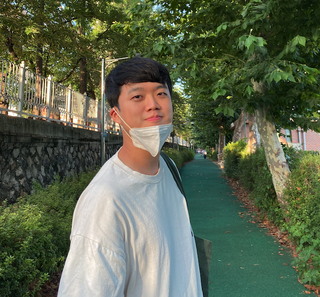

# 모두를 위한 컨벡스 최적화

- [블로그](<https://convex-optimization-for-all.github.io/>)
- [모두를 위한 컨벡스 최적화](<https://wikidocs.net/book/1896>)

## 저자 서문

기계학습에 세간의 이목이 집중되며 최적화에 대한 관심도도 나날이 상승하고 있습니다. 허나, 입문자를 위한 한글자료가 풍부하지 않아 많은 분들이 그 진입장벽으로 힘들어하는 것에 안타까움을 느꼈습니다. 이에 모두의 연구소의 풀잎스쿨에 Convex Optimization 과정을 개설하였고, 지식 나눔을 실천하고자 하는 참여자분들의 선의의 의지에 힘입어 본 프로젝트를 시작하게 되었습니다. 이 활동을 통해 부디 전국민의 지적 성장과 컨벡스 최적화의 국내 대중화에 힘을 보탤수 있길 기원합니다.

이 문서의 전반적인 내용은 [카네기멜론 대학 강의자료](http://www.stat.cmu.edu/~ryantibs/convexopt-F16/)를 참고하였고, 보조 교재로는 [스탠포드 대학 강의자료](https://web.stanford.edu/~boyd/cvxbook/)를 사용하였습니다. 본 ebook을 중심으로 두 강의자료를 레퍼런스로 공부하시면 좋습니다.

www.jwpark.co.kr@gmail.com / 박진우 (컨벡스 최적화 풀잎스쿨, 모두의 연구소)

## 옮긴이 서문

최근 머신러닝의 지속적인 발전 속에서 다양한 연구들이 진행되고 있고, 이를 현실 문제에 적용하려는 움직임 또한 커지고 있습니다. 하지만 머신러닝의 근간을 이루는 수학에 대한 심도 높은 이해가 없다면 그에 대한 이해와 적용 또한 피상적으로 이뤄질 수 밖에 없습니다.

Convex Optimization은 머신러닝과 직접적으로 연관이 많을 뿐더러 선형대수, 미적분학, 수치해석과 같이 수학의 다양한 하위 분야들을 포함하고 있다는 점에서 머신러닝을 공부하는 사람들에게 매력적인 학문입니다. 다만 홀로 다루기에는 내용이 적지 않을 뿐더러 학문 자체의 난이도도 높은 편이기에 함께 공부할 사람들을 모아 2021년 Convex Optimization Study를 시작하게 되었습니다. 본 Blog는 함께 진행한 Study의 흔적이자, 후에 혼자 공부하고자 하시는 분들께 도움을 드리고자 만들었습니다.

본 Blog의 주요 컨텐츠는 [모두를 위한 컨벡스 최적화](<https://wikidocs.net/book/1896>)의 저자 분들의 동의를 구해 Migration한 내용들입니다. 원 컨텐츠는 Convex Optimization에 관한 한국어 컨텐츠 중 가장 잘 알려져 있으면서 내용적으로도 부족함이 없습니다. 본 Blog에서는 기존 WikiDocs 컨텐츠를 이어 받아 Open Source로 만들어 보고자 합니다. 따라서 누구나 컨텐츠에 이슈를 제기하고 직접 Pull Request를 생성하여 기여할 수 있습니다. 이를 통해 [모두를 위한 컨벡스 최적화](<https://wikidocs.net/book/1896>) 저자분들의 뜻이기도 한 '전국민의 지적 성장과 컨벡스 최적화의 국내 대중화'에 작은 보탬이 될 수 있기를 바랍니다.

wgm0601@gmail.com / 우경민 (마키나락스)

## 만든 사람들

### 모두를 위한 컨벡스 최적화 저자

- 김기범(astroblasterr@gmail.com)
- 김정훈(placidus36@gmail.com)
- 노원종(wnoh27@naver.com)
- 박진우(www.jwpark.co.kr@gmail.com)
- 윤성진(sjyoon@gmail.com)
- 이규복(gyubokl@gmail.com)
- 한영일(thinkingtoyihan@gmail.com)
- 황혜진(brillianthhj@gmail.com)
- [저자 소개](<https://wikidocs.net/17197>)

### 모두를 위한 컨벡스 최적화 리뷰어

- 이주희 (juhee1108@gmail.com)
- 장승환 (schang.math@gmail.com)
- 정태수 (tcheong@korea.ac.kr)
- [리뷰어 소개](<https://wikidocs.net/17197>)

### Open Source Contributors

<!-- ALL-CONTRIBUTORS-LIST:START - Do not remove or modify this section -->
<!-- prettier-ignore-start -->
<!-- markdownlint-disable -->
<table>
  <tr>
    <td align="center">
      <a href="">
        
         
        <b>박진우</b></a>
         
        <a href="" title="Code">💻</a> 
        <a href="" title="Documentation">📖</a>
    </td>
    <td align="center">
      <a href="https://www.linkedin.com/in/enfow/">
        
         
        <b>우경민</b></a>
         
        <a href="https://github.com/enfow/" title="Code">💻</a> 
        <a href="https://www.linkedin.com/in/enfow/" title="Documentation">📖</a>
    </td>
    <td align="center">
      <a href="">
        
         
        <b>류원탁</b></a>
         
        <a href="" title="Code">💻</a> 
        <a href="" title="Documentation">📖</a>
    </td>
    <td align="center">
      <a href="">
        
         
        <b>이민주</b></a>
         
        <a href="" title="Code">💻</a> 
        <a href="" title="Documentation">📖</a>
    </td>
    <td align="center">
      <a href="">
        
         
        <b>정영재</b></a>
         
        <a href="" title="Code">💻</a> 
        <a href="" title="Documentation">📖</a>
    </td>
    <td align="center">
      <a href="">
        
         
        <b>신훈철</b></a>
         
        <a href="" title="Code">💻</a> 
        <a href="" title="Documentation">📖</a>
    </td>
    <td align="center">
      <a href="">
        
         
        <b>김민섭</b></a>
         
        <a href="" title="Code">💻</a> 
        <a href="" title="Documentation">📖</a>
    </td>
  </tr>
</table>

<!-- markdownlint-enable -->
<!-- prettier-ignore-end -->
<!-- ALL-CONTRIBUTORS-LIST:END -->

This project follows the [all-contributors](https://allcontributors.org) specification.
Contributions of any kind are welcome!

## 다루는 내용들

| idx | Title | 모두를 위한 컨벡스 최적화 | Lecture | Slide | Code Owner | 
|---|---|---|---|---|---|
| 1 | Introduction | [Page](<https://wikidocs.net/17202>)  | [CMU Lecture](<https://www.youtube.com/watch?v=XFKBNJ14UmY&ab_channel=RyanT>)  | [CMU Note](<http://www.stat.cmu.edu/~ryantibs/convexopt-F16/lectures/intro.pdf>)  | 우경민 |
| 2 | Convex Sets | [Page](<https://wikidocs.net/17370>)  | [Stanford Lecture](<https://www.youtube.com/watch?v=P3W_wFZ2kUo&list=PL3940DD956CDF0622&index=3&ab_channel=Stanford>)  | [Stanford Note](<https://web.stanford.edu/class/ee364a/lectures/sets.pdf>)  | 류원탁 |
| 3 | Convex Functions | [Page](<https://wikidocs.net/17267>)  | [Stanford Lecture](<https://www.youtube.com/watch?v=kcOodzDGV4c&list=PL3940DD956CDF0622&index=4&ab_channel=Stanford>)  | [Stanford Note](<https://see.stanford.edu/materials/lsocoee364a/03ConvexFunctions.pdf>)  | 이민주 |
| 4 | Convex Optimization Basis | [Page](<https://wikidocs.net/18335>)  | [CMU Lecture](<https://www.youtube.com/watch?v=Gij3dlqLUN8&list=PLjbUi5mgii6AVdvImLB9-Hako68p9MpIC&index=5&ab_channel=RyanT>)  | [CMU Note](<http://www.stat.cmu.edu/~ryantibs/convexopt-F16/lectures/convex-opt.pdf>)  |  정영재  |
| 5 | Canonical Problems | [Page](<https://wikidocs.net/17851>)  | [CMU Lecture](<http://www.stat.cmu.edu/~ryantibs/convexopt-F16/>)  | [CMU Note](<http://www.stat.cmu.edu/~ryantibs/convexopt-F16/>)  |  신훈철  |
| 6 | Gradient Descent | [Page](<https://wikidocs.net/18083>)  | [CMU Lecture](<http://www.stat.cmu.edu/~ryantibs/convexopt-F16/>)  | [CMU Note](<http://www.stat.cmu.edu/~ryantibs/convexopt-F16/>)  |    |
| 7 | Subgradient | [Page](<https://wikidocs.net/18714>)  | [CMU Lecture](<http://www.stat.cmu.edu/~ryantibs/convexopt-F16/>)  | [CMU Note](<http://www.stat.cmu.edu/~ryantibs/convexopt-F16/>)  |    |
| 8 | Subgradient Method | [Page](<https://wikidocs.net/18952>)  | [CMU Lecture](<http://www.stat.cmu.edu/~ryantibs/convexopt-F16/>)  | [CMU Note](<http://www.stat.cmu.edu/~ryantibs/convexopt-F16/>)  |    |
| 9 | Proximal Gradient Descent and Acceleration | [Page](<https://wikidocs.net/19031>)  | [CMU Lecture](<http://www.stat.cmu.edu/~ryantibs/convexopt-F16/>)  | [CMU Note](<http://www.stat.cmu.edu/~ryantibs/convexopt-F16/>)  |    |
| 10 | Duality in Linear Programs | [Page](<https://wikidocs.net/19932>)  | [CMU Lecture](<http://www.stat.cmu.edu/~ryantibs/convexopt-F16/>)  | [CMU Note](<http://www.stat.cmu.edu/~ryantibs/convexopt-F16/>)  |    |
| 11 | Duality in General Programs | [Page](<https://wikidocs.net/20582>)  | [CMU Lecture](<http://www.stat.cmu.edu/~ryantibs/convexopt-F16/>)  | [CMU Note](<http://www.stat.cmu.edu/~ryantibs/convexopt-F16/>)  |    |
| 12 | KKT Conditions | [Page](<https://wikidocs.net/20948>)  | [CMU Lecture](<http://www.stat.cmu.edu/~ryantibs/convexopt-F16/>)  | [CMU Note](<http://www.stat.cmu.edu/~ryantibs/convexopt-F16/>)  |    |
| 13 | CanonicalDuality uses and correspondences | [Page](<https://wikidocs.net/20949>)  | [CMU Lecture](<http://www.stat.cmu.edu/~ryantibs/convexopt-F16/>)  | [CMU Note](<http://www.stat.cmu.edu/~ryantibs/convexopt-F16/>)  |    |
| 14 | Newton's Method | [Page](<https://wikidocs.net/21007>)  | [CMU Lecture](<http://www.stat.cmu.edu/~ryantibs/convexopt-F16/>)  | [CMU Note](<http://www.stat.cmu.edu/~ryantibs/convexopt-F16/>)  |    |
| 15 | Barrier Method | [Page](<https://wikidocs.net/21297>)  | [CMU Lecture](<http://www.stat.cmu.edu/~ryantibs/convexopt-F16/>)  | [CMU Note](<http://www.stat.cmu.edu/~ryantibs/convexopt-F16/>)  |    |
| 16 | Duality Revisited | [Page](<https://wikidocs.net/21643>)  | [CMU Lecture](<http://www.stat.cmu.edu/~ryantibs/convexopt-F16/>)  | [CMU Note](<http://www.stat.cmu.edu/~ryantibs/convexopt-F16/>)  |    |
| 17 | Primal-Dual Interior-Point Methods | [Page](<https://wikidocs.net/17851>)  | [CMU Lecture](<http://www.stat.cmu.edu/~ryantibs/convexopt-F16/>)  | [CMU Note](<http://www.stat.cmu.edu/~ryantibs/convexopt-F16/>)  |    |
| 18 | Quasi-Newton Methods | [Page](<https://wikidocs.net/21979>)  | [CMU Lecture](<http://www.stat.cmu.edu/~ryantibs/convexopt-F16/>)  | [CMU Note](<http://www.stat.cmu.edu/~ryantibs/convexopt-F16/>)  |    |
| 19 | Proximal Netwon Method | [Page](<https://wikidocs.net/22424>)  | [CMU Lecture](<http://www.stat.cmu.edu/~ryantibs/convexopt-F16/>)  | [CMU Note](<http://www.stat.cmu.edu/~ryantibs/convexopt-F16/>)  |    |
| 20 | Dual Methods | [Page](<https://wikidocs.net/22602>)  | [CMU Lecture](<http://www.stat.cmu.edu/~ryantibs/convexopt-F16/>)  | [CMU Note](<http://www.stat.cmu.edu/~ryantibs/convexopt-F16/>)  |    |
| 21 | Alternating Direction Method of Mulipliers | [Page](<https://wikidocs.net/22687>)  | [CMU Lecture](<http://www.stat.cmu.edu/~ryantibs/convexopt-F16/>)  | [CMU Note](<http://www.stat.cmu.edu/~ryantibs/convexopt-F16/>)  |    |
| 22 | Conditional Gradient Method | [Page](<https://wikidocs.net/22688>)  | [CMU Lecture](<http://www.stat.cmu.edu/~ryantibs/convexopt-F16/>)  | [CMU Note](<http://www.stat.cmu.edu/~ryantibs/convexopt-F16/>)  |    |
| 23 | Coordinate Descent | [Page](<https://wikidocs.net/23359>)  | [CMU Lecture](<http://www.stat.cmu.edu/~ryantibs/convexopt-F16/>)  | [CMU Note](<http://www.stat.cmu.edu/~ryantibs/convexopt-F16/>)  |    |
| 24 | Mixed Integer Programming 1 | [Page](<https://wikidocs.net/23447>)  | [CMU Lecture](<http://www.stat.cmu.edu/~ryantibs/convexopt-F16/>)  | [CMU Note](<http://www.stat.cmu.edu/~ryantibs/convexopt-F16/>)  |    |
| 25 | Mixed Integer Programming 2 | [Page](<https://wikidocs.net/23718>)  | [CMU Lecture](<http://www.stat.cmu.edu/~ryantibs/convexopt-F16/>)  | [CMU Note](<http://www.stat.cmu.edu/~ryantibs/convexopt-F16/>)  |    |

## 참고한 자료들

- [Convex Optimization - Boyd and Vandenberghe](<https://web.stanford.edu/~boyd/cvxbook/>)
- [Stanford Convex Optimization Lecture 2014](<https://www.youtube.com/playlist?list=PL3940DD956CDF0622>)
- [CMU Convex Optimization Lecture 2016](<http://www.stat.cmu.edu/~ryantibs/convexopt-F16/>)
- [CMU Convex Optimization Lecture 2019](<http://www.stat.cmu.edu/~ryantibs/convexopt/>)
